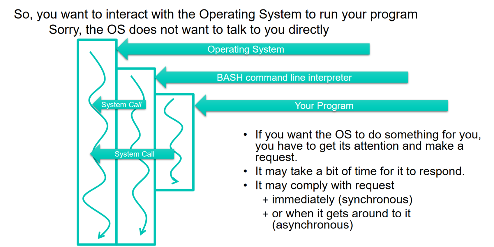

# Systems Programming Reference 
|              |                                                                                                                                                      |
|--------------|------------------------------------------------------------------------------------------------------------------------------------------------------|
| Notes from:  | CPE2600 - Systems Programming (Fall 2024)                                                                                                            |
| Instructor:  | Dr. Bob Turney                                                                                                                                       |
| Name:        | Leigh Goetsch                                                                                                                                        |
| Description: | This document is a reference for systems programming in C. It includes information on system calls, signals, and other low-level programming topics. |

## System Calls
### Highlighted system calls:
- `chmod(2);`
- `fork(2);`
- `getpid(2);`
- `kill(2);`
- `nanosleep(2);`
- `pipe(2);`
- `recv(2);`
- `recvfrom(2);`
- `shutdown(2);`
- `syscall(2);`
- `waitpid(2);`
- `write(2);`

### Defining System Calls
- Normally associated with programs that provide access to services provided by an operating system
  - Often a "library" of code that **application programs** would use to access system services
  - Example: `libc` itself not really in this category, but we know `libc` needs access to dynamic memory and file system, so `libc` would rely on some underlying code to interact with operating system
- Working definition will be a little bit more broad: **consider "system programming" as writing programs that take advantage of operating system "facilities"**
  - Will be able to achieve behaviour simply not available by only using `libc`
    - Multithreading
    - Inter-Proces Communication (IPC)
    - File ystem Interaction
    - Networking, ... etc.

- System calls provide an interface for applications to use operating system services in **privileged mode**
  - **Privileged mode**: mode in which the CPU can execute all instructions, including privileged instructions
    - **Privileged instructions**: instructions that can only be executed in privileged mode
  - **User mode**: mode in which the CPU can execute a subset of instructions
    - **User instructions**: instructions that can be executed in user mode
  - **Kernel mode**: another term for privileged mode
- Typically involves some "trap" or "interrupt" mechanism
  - **Trap**: a mechanism that allows a program to transfer control to the operating system
  - **Interrupt**: a signal that is sent to the CPU to get its attention

### 
- process id 
  - [code example] `getpid()` is returning the same as `syscall(39)`
  - this is because `getpid()` is a wrapper around `syscall(39)`: `getpid()` is a function in `libc` that calls `syscall(39)` to get the process id
